<div align="center">

# Korp ERP

### Estoque e emissão de notas fiscais em uma arquitetura de microsserviços

Angular 19 · ASP.NET Core 9 · PostgreSQL · RabbitMQ · Groq

[](https://dotnet.microsoft.com/)
[](https://angular.dev/)
[](https://www.postgresql.org/)
[](https://www.rabbitmq.com/)
[](https://docs.docker.com/compose/)

</div>

## Sobre o projeto

O **Korp ERP** é uma aplicação full stack para gerenciamento de produtos,
controle de estoque e emissão de notas fiscais. A solução separa os contextos de
estoque e faturamento, utiliza eventos para a baixa assíncrona e oferece uma
análise consultiva opcional de notas fiscais com Inteligência Artificial.

O projeto foi desenvolvido como desafio técnico, priorizando código legível,
contratos HTTP consistentes, validações nas duas camadas, resiliência e uma
interface moderna e responsiva.

## Funcionalidades

- cadastro, edição, pesquisa e exclusão de produtos;
- controle de saldo com precisão de quatro casas decimais;
- criação de notas com múltiplos itens e autocomplete de produtos;
- cálculo e validação dos totais no frontend e no backend;
- impressão/fechamento da nota com chave de idempotência;
- baixa assíncrona de estoque por RabbitMQ;
- tratamento padronizado de validações e erros;
- logs estruturados, health checks e Swagger;
- análise consultiva de notas com Groq e GPT-OSS;
- fallback seguro: indisponibilidade da IA não bloqueia o sistema.

## Capturas de tela

### Página inicial

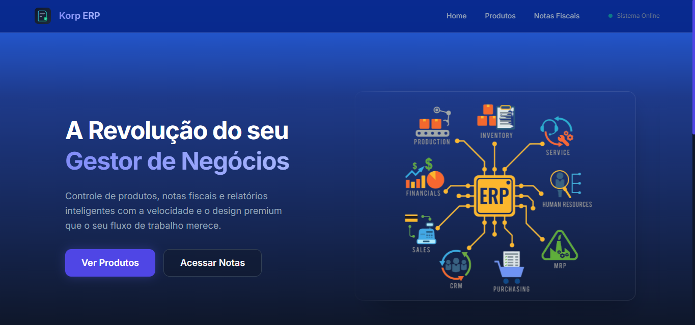

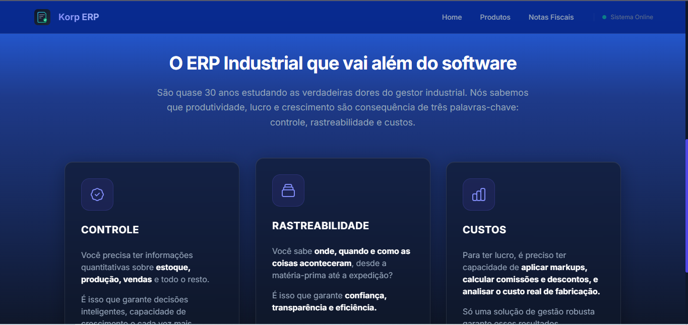

### Gestão de produtos

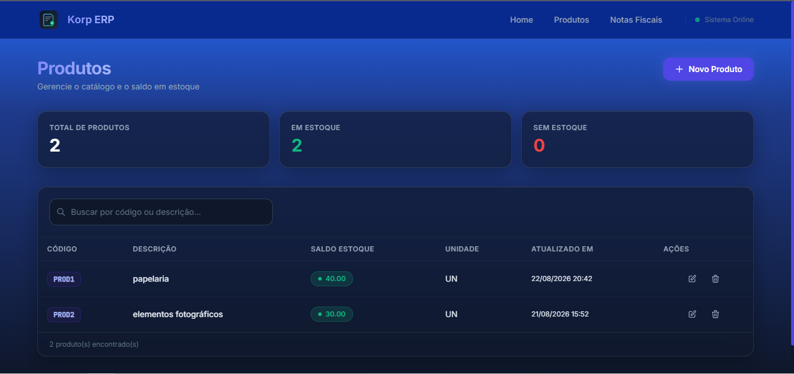

<p align="center">
  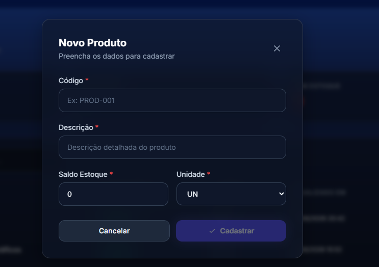
  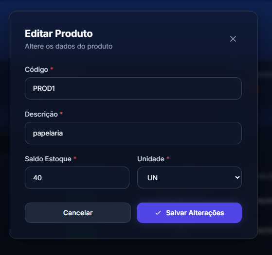
</p>
<p align="center">
  <sub>Cadastro de um novo produto e edição segura dos dados permitidos.</sub>
</p>

<p align="center">
  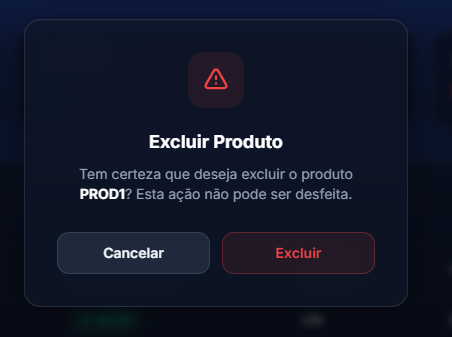
</p>
<p align="center">
  <sub>Confirmação explícita antes da exclusão de um produto.</sub>
</p>

### Gestão de notas fiscais

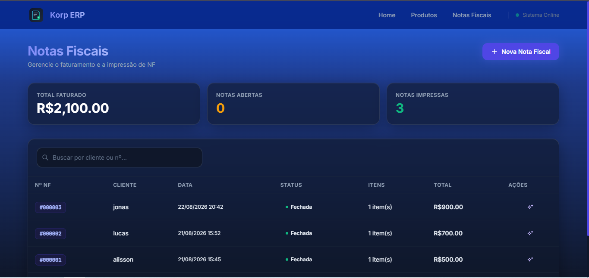

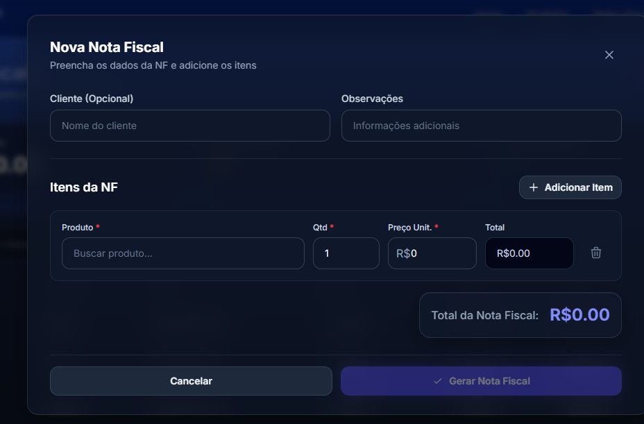

### Análise com Inteligência Artificial

<p align="center">
  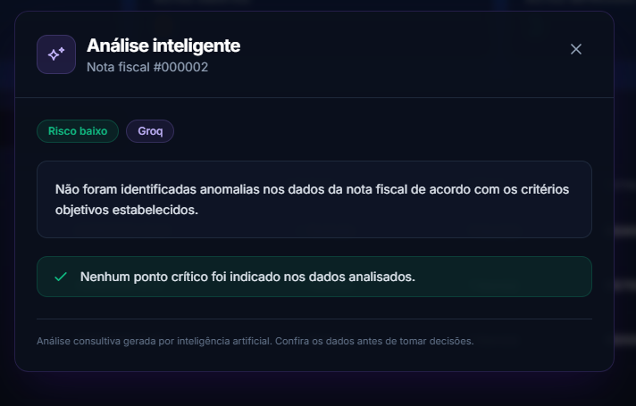
</p>
<p align="center">
  <sub>Análise consultiva concluída pela Groq com resposta estruturada.</sub>
</p>

<p align="center">
  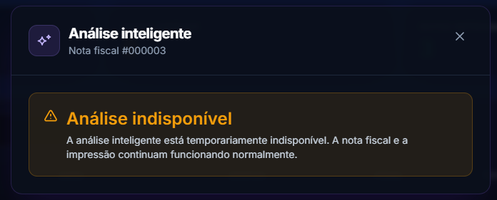
</p>
<p align="center">
  <sub>Fallback resiliente: a indisponibilidade da IA não bloqueia a aplicação.</sub>
</p>

## Arquitetura

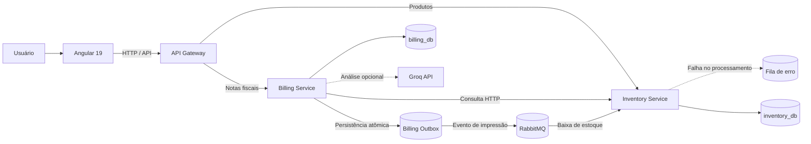

| Camada | Tecnologias |
| --- | --- |
| Frontend | Angular 19, RxJS, Reactive Forms, Signals e Tailwind CSS |
| Gateway e APIs | YARP, ASP.NET Core 9, FluentValidation, Serilog e Swagger |
| Persistência | Entity Framework Core 9, Npgsql e PostgreSQL 16 |
| Mensageria | RabbitMQ e MassTransit |
| Resiliência | Polly, health checks, timeout e fallback |
| IA | Groq API com GPT-OSS e resposta estruturada por JSON Schema |

Mais detalhes estão em [`detalhamento_tecnico.md`](detalhamento_tecnico.md).

## Como executar

### Pré-requisitos

- [Docker Desktop](https://www.docker.com/products/docker-desktop/);
- [Node.js 20 LTS](https://nodejs.org/) e npm;
- opcionalmente, [.NET SDK 9](https://dotnet.microsoft.com/download/dotnet/9.0)
  para executar ou testar os serviços fora dos contêineres.

### 1. Clone o repositório

```bash
git clone https://github.com/alissonjcjk/Korp_Teste_Alisson_Bernadino.git
cd Korp_Teste_Alisson_Bernadino
```

### 2. Suba a infraestrutura e os serviços

```bash
docker compose up --build -d
```

O Compose inicia PostgreSQL, RabbitMQ, os dois microsserviços e o API Gateway.
As migrations são aplicadas automaticamente na inicialização.

### 3. Inicie o frontend

```bash
cd frontend/korp-erp-frontend
npm ci
npm start
```

Acesse **http://localhost:4200**.

### 4. Configure a IA — opcional

A aplicação funciona normalmente sem IA. Para habilitar a análise, defina a
chave apenas como variável de ambiente **antes** de subir o Billing Service.

Crie um arquivo local a partir do exemplo:

```powershell
Copy-Item .env.example .env
# Abra .env e preencha GROQ_API_KEY com a sua chave.
docker compose up --build -d billing-service
```

Não salve nem publique a chave no repositório. Consulte a
[`documentação da integração`](docs/ai-invoice-analysis.md) para detalhes.

## Endereços locais

| Recurso | Endereço |
| --- | --- |
| Aplicação Angular | http://localhost:4200 |
| API Gateway | http://localhost:5000 |
| Inventory API + Swagger (acesso direto) | http://localhost:5001 |
| Billing API + Swagger (acesso direto) | http://localhost:5002 |
| RabbitMQ Management | http://localhost:15672 |
| Health — Gateway | http://localhost:5000/health |
| Health — Inventory | http://localhost:5001/health |
| Health — Billing | http://localhost:5002/health |

O acesso local padrão ao RabbitMQ Management é `guest` / `guest`.

## Endpoints principais

### Produtos

| Método | Endpoint | Descrição |
| --- | --- | --- |
| `GET` | `/api/inventory/products?search=` | Lista e pesquisa produtos |
| `GET` | `/api/inventory/products/{id}` | Consulta um produto |
| `POST` | `/api/inventory/products` | Cadastra um produto |
| `PUT` | `/api/inventory/products/{id}` | Atualiza descrição e unidade |
| `DELETE` | `/api/inventory/products/{id}` | Exclui um produto |
| `POST` | `/api/inventory/products/{id}/deduct-stock` | Realiza baixa de estoque |

### Notas fiscais

| Método | Endpoint | Descrição |
| --- | --- | --- |
| `GET` | `/api/billing/invoices` | Lista notas fiscais |
| `GET` | `/api/billing/invoices/{id}` | Consulta uma nota |
| `POST` | `/api/billing/invoices` | Cria uma nota |
| `POST` | `/api/billing/invoices/{id}/print` | Imprime e fecha a nota |
| `POST` | `/api/billing/invoices/{id}/ai-analysis` | Solicita análise consultiva por IA |

## Testes

Backend:

```powershell
dotnet restore .\Korp.Erp.slnx
dotnet build .\Korp.Erp.slnx --configuration Release --no-restore
dotnet test .\Korp.Erp.slnx --configuration Release --no-build
```

Frontend:

```powershell
Set-Location .\frontend\korp-erp-frontend
npm ci
npm run build
npm run test:ci
```

Esses comandos validam a compilação de produção e as suítes automatizadas dos
microsserviços e do frontend.

## Estrutura do repositório

```text
.
├── docs/                         # Guias técnicos e imagens
├── frontend/korp-erp-frontend/  # Aplicação Angular
├── infra/postgres/              # Inicialização dos bancos
├── services/
│   ├── api-gateway/             # Entrada única e roteamento com YARP
│   ├── billing-service/         # Notas fiscais e integração de IA
│   └── inventory-service/       # Produtos e estoque
├── docker-compose.yml
├── Korp.Erp.slnx
└── detalhamento_tecnico.md
```

## Documentação

- [Detalhamento técnico](detalhamento_tecnico.md)
- [Erros e validações](docs/api-errors-and-validation.md)
- [Análise de notas com IA](docs/ai-invoice-analysis.md)

## Observações de segurança

- nunca versione chaves, tokens ou arquivos `.env` com credenciais;
- os usuários e senhas do Compose são apenas para desenvolvimento local;
- a análise de IA é consultiva e não substitui validação humana;
- nome do cliente e observações da nota não são enviados à Groq.

## Próximas evoluções

- reforçar atomicidade em impressões simultâneas;
- ativar Inbox e redelivery controlado no consumidor;
- adicionar recuperação/compensação para falhas na baixa assíncrona;
- ampliar os testes de integração com PostgreSQL e RabbitMQ;
- adicionar autenticação e autorização.

---

<div align="center">

Desenvolvido para o desafio técnico da **Korp**.

</div>
