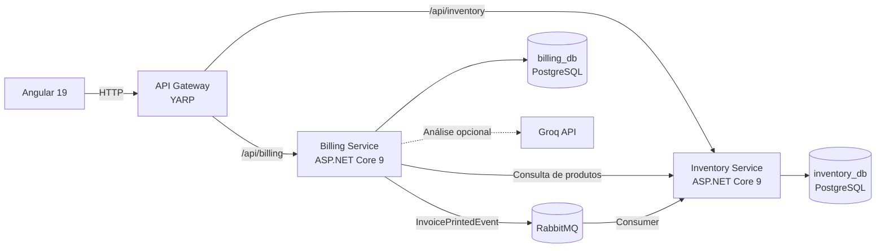

# Detalhamento técnico — Korp ERP

Este documento descreve as decisões técnicas, os fluxos e as bibliotecas usadas
no sistema de controle de estoque e emissão de notas fiscais. Ele complementa o
[`README.md`](README.md), que contém a apresentação e as instruções de execução.

## Sumário

- [1. Visão geral da arquitetura](#1-visão-geral-da-arquitetura)
- [2. Frontend Angular](#2-frontend-angular)
- [3. Backend e persistência](#3-backend-e-persistência)
- [4. Fluxos principais](#4-fluxos-principais)
- [5. Contratos, validações e erros](#5-contratos-validações-e-erros)
- [6. Resiliência e consistência](#6-resiliência-e-consistência)
- [7. Inteligência Artificial](#7-inteligência-artificial)
- [8. Testes e documentação](#8-testes-e-documentação)
- [9. Respostas objetivas ao desafio](#9-respostas-objetivas-ao-desafio)
- [10. Limites conhecidos e próximos passos](#10-limites-conhecidos-e-próximos-passos)

## 1. Visão geral da arquitetura

A solução segue uma arquitetura de microsserviços, com bancos separados para
estoque e faturamento. O frontend consome as APIs por HTTP e o fechamento da
nota publica um evento no RabbitMQ para que a baixa de estoque seja processada.



### Responsabilidades

| Componente | Responsabilidade |
| --- | --- |
| Angular | Cadastro e consulta de produtos, criação e impressão de notas e análise consultiva por IA |
| API Gateway | Ponto único de entrada HTTP, roteamento e isolamento dos endereços internos dos serviços |
| Inventory Service | Catálogo de produtos, saldo, baixa e concorrência de estoque |
| Billing Service | Criação, consulta, totalização, fechamento e análise das notas fiscais |
| PostgreSQL | Persistência isolada de cada contexto de negócio |
| RabbitMQ + MassTransit | Comunicação assíncrona do evento de impressão |
| Groq + GPT-OSS | Análise opcional e consultiva dos dados da nota |

## 2. Frontend Angular

O frontend foi implementado com Angular 19, standalone components, formulários
reativos e carregamento preguiçoso das páginas. A estilização utiliza Tailwind
CSS e os elementos visuais foram construídos no próprio projeto, sem Angular
Material, Bootstrap ou PrimeNG.

### Organização

- `core`: interceptadores, modelos compartilhados, serviços e validadores;
- `features/inventory`: página, formulário, modelos e serviço de produtos;
- `features/billing`: página, formulários, modelos, serviço e modal de IA;
- `shared`: componentes reutilizáveis, como o contêiner de notificações.

### Estado e reatividade

- `signal` mantém estados locais como listagens, carregamento e modal ativo;
- `computed` deriva listas filtradas sem duplicar estado;
- `Subject`, `debounceTime`, `distinctUntilChanged` e `switchMap` implementam o
  autocomplete de produtos;
- `map` extrai os dados do envelope padrão das APIs;
- `catchError` centraliza a normalização das falhas HTTP no interceptor.

### Ciclo de vida

`ngOnInit` é usado nas páginas de produtos e notas para carregar os dados
iniciais. No formulário de nota, ele também inicia o fluxo reativo de busca de
produtos. Assinaturas que precisam acompanhar o componente são encerradas pelo
mecanismo de destruição do Angular, evitando vazamentos.

## 3. Backend e persistência

Os dois serviços usam ASP.NET Core 9 e uma separação simples por controllers,
DTOs, validadores, serviços de aplicação, modelos e acesso a dados.

### Principais tecnologias

| Tecnologia | Uso |
| --- | --- |
| ASP.NET Core 9 | Web APIs, middleware, health checks e injeção de dependência |
| YARP | Reverse proxy e roteamento do gateway para os microsserviços |
| Entity Framework Core 9 | Mapeamento, consultas, transações e migrations |
| Npgsql | Provider PostgreSQL e convenção `snake_case` |
| FluentValidation | Regras de entrada desacopladas dos controllers |
| MassTransit | Publicação e consumo do evento de impressão |
| Polly | Retry e circuit breaker nas chamadas Billing → Inventory |
| Serilog | Logs estruturados e rastreáveis |
| Swashbuckle | OpenAPI e Swagger UI |

Cada microsserviço possui seu próprio `DbContext`, banco e migrations. As
migrations são aplicadas na inicialização. O PostgreSQL utiliza `numeric(18,4)`
para saldos, quantidades, preços e totais.

## 4. Fluxos principais

### Cadastro de produto

1. O Angular valida os campos obrigatórios e a precisão decimal.
2. O Inventory Service repete as validações com FluentValidation.
3. O código é verificado quanto à duplicidade.
4. O produto é persistido e devolvido no envelope padrão de sucesso.

### Criação de nota fiscal

1. O usuário adiciona de 1 a 100 itens pelo autocomplete.
2. O Billing Service consulta o Inventory Service para obter os dados atuais dos
   produtos.
3. Totais de linha e da nota são calculados e arredondados para quatro casas.
4. A nota é criada no estado aberto.

### Impressão e baixa de estoque

1. O Angular envia a impressão com um `Idempotency-Key`.
2. O Billing Service fecha a nota e publica `InvoicePrintedEvent` pelo
   MassTransit.
3. O Inventory Service consome o evento e baixa os itens em uma transação.
4. O controle otimista de concorrência do PostgreSQL impede atualização perdida
   do saldo.

A impressão e a baixa pertencem a transações e serviços diferentes. Por isso,
as garantias distribuídas e seus limites são explicitados na seção
[Limites conhecidos](#10-limites-conhecidos-e-próximos-passos).

## 5. Contratos, validações e erros

Respostas bem-sucedidas usam `ApiResponse<T>`. Erros usam um contrato comum nos
dois serviços:

```json
{
  "success": false,
  "statusCode": 400,
  "message": "Um ou mais erros de validação ocorreram.",
  "errors": {
    "StockBalance": ["O saldo inicial é obrigatório."]
  },
  "traceId": "0HN...",
  "timestamp": "2026-08-22T22:00:00+00:00"
}
```

O middleware global converte falhas conhecidas em 400, 404, 409 ou 503 e mantém
mensagens internas fora da resposta. Erros inesperados retornam 500 com mensagem
genérica. `traceId` permite correlacionar o retorno aos logs.

Os DTOs são validados pelo FluentValidation. O Angular antecipa as mesmas regras
para melhorar a experiência, mas o backend permanece como fonte de verdade.
Precisão decimal, campos obrigatórios, limites de texto, item nulo, quantidade
máxima de itens e valores totais são protegidos antes da persistência.

O contrato completo está em
[`docs/api-errors-and-validation.md`](docs/api-errors-and-validation.md).

## 6. Resiliência e consistência

### Implementado

- retry e circuit breaker nas chamadas do Billing para o Inventory;
- health checks dos bancos;
- transação na baixa dos itens de uma nota;
- concorrência otimista baseada no `xmin` do PostgreSQL;
- chave de idempotência única no fechamento da nota;
- EF Core Bus Outbox no Billing Service para publicação ligada ao contexto;
- timeout e fallback na integração opcional com IA;
- logs estruturados e respostas com `traceId`.

### Escopo atual da idempotência

A mesma chave de impressão pode ser repetida de forma segura no fluxo serial. A
proteção ainda não equivale a uma garantia distribuída completa: impressões
simultâneas com chaves diferentes e redelivery após determinados pontos do
consumer exigem as melhorias listadas na seção 10.

## 7. Inteligência Artificial

A ação **Analisar com IA** é independente da impressão. O Billing Service chama
a Groq API com o modelo configurado, atualmente `openai/gpt-oss-20b`, e solicita
uma resposta estruturada por JSON Schema em modo estrito.

A análise contém:

- resumo consultivo;
- indicação e nível de risco;
- pontos que merecem conferência;
- sugestões objetivas;
- provedor e horário da análise.

Somente número, status, total e itens são enviados. Nome do cliente e observações
não são compartilhados. Descrições e códigos são tratados como conteúdo não
confiável, a resposta é validada pelo backend e a análise não toma decisões nem
altera a nota.

Se a chave estiver ausente, houver timeout, erro HTTP ou resposta inválida, a API
retorna um resultado indisponível amigável. Cadastro e impressão permanecem
funcionais. A configuração está documentada em
[`docs/ai-invoice-analysis.md`](docs/ai-invoice-analysis.md).

## 8. Testes e documentação

Há testes de unidade e contrato para Inventory Service, Billing Service e
Angular. Eles cobrem validadores, serviços, mapeamentos, controllers, middleware,
contratos HTTP, interceptador e formulários.

Comandos principais:

```powershell
dotnet test .\Korp.Erp.slnx --configuration Release

Set-Location .\frontend\korp-erp-frontend
npm run test:ci
```

O histórico do baseline e os scripts de verificação estão descritos em
[`docs/testing.md`](docs/testing.md). Conforme solicitado para a entrega rápida
do bônus, a integração de IA foi verificada manualmente e não recebeu uma suíte
automatizada específica.

## 9. Respostas objetivas ao desafio

### Quais ciclos de vida do Angular foram utilizados?

Principalmente `ngOnInit`, para carregar listagens e iniciar o fluxo de busca do
formulário de nota. A destruição das assinaturas é vinculada ao ciclo de vida do
componente.

### RxJS foi utilizado? De que forma?

Sim. `Subject`, `debounceTime`, `distinctUntilChanged` e `switchMap` compõem o
autocomplete; `map` transforma respostas; `catchError` normaliza as falhas HTTP
no interceptor global.

### Quais outras bibliotecas foram utilizadas?

No frontend, Tailwind CSS para estilização. No backend, EF Core, Npgsql,
FluentValidation, MassTransit, Polly, Serilog e Swashbuckle, conforme detalhado
na seção 3.

### Quais bibliotecas de componentes visuais foram utilizadas?

Nenhuma biblioteca pronta de componentes. Tabelas, formulários, modais, badges,
botões e notificações foram construídos com Angular, HTML e Tailwind CSS.

### Como as dependências são gerenciadas no Go?

Não aplicável. A alternativa escolhida no desafio foi C#/.NET. Dependências .NET
são declaradas nos arquivos `.csproj`; as do Angular ficam em `package.json` e
`package-lock.json`.

### Quais frameworks foram utilizados no C#?

ASP.NET Core 9 para as APIs e Entity Framework Core 9 para persistência, além das
bibliotecas descritas na seção 3.

### Como erros e exceções foram tratados?

Exceções de domínio e falhas de infraestrutura são centralizadas por middleware.
O middleware escolhe o status HTTP, produz o envelope seguro e registra os
detalhes técnicos apenas no servidor.

### LINQ foi utilizado?

Sim. `Where` implementa filtros, `Select` projeta entidades em DTOs, `AnyAsync`
verifica existência/duplicidade e agregações auxiliam regras e consultas. As
operações são mantidas em `IQueryable` quando devem ser traduzidas para SQL.

## 10. Limites conhecidos e próximos passos

Os itens abaixo são mantidos visíveis para diferenciar proteções existentes de
garantias ainda não implementadas:

1. tornar o fechamento da nota atômico diante de duas impressões simultâneas com
   chaves diferentes;
2. ativar o Entity Framework Inbox no endpoint consumidor e configurar
   redelivery/retry controlado;
3. garantir recuperação ou compensação quando a nota é fechada, mas a baixa
   assíncrona falha;
4. adicionar testes reais de concorrência e integração com PostgreSQL/RabbitMQ;
5. acompanhar limites e eventuais mudanças de modelos do plano gratuito da Groq.

Esses pontos não impedem a demonstração dos fluxos principais, mas são os
próximos passos recomendados antes de um cenário de produção.
